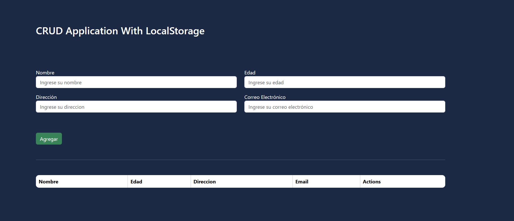

# CRUD de Personas en JavaScript

Este proyecto es una aplicación web simple desarrollada con **HTML, CSS y JavaScript puro**, que permite realizar operaciones CRUD (Crear, Leer, Actualizar, Eliminar) sobre una lista de personas almacenadas localmente mediante `localStorage`.

## 📋 Características

- Validación básica de formulario (nombre, edad, dirección y correo electrónico)
- Almacenamiento persistente con `localStorage`
- Funcionalidad para:
  - Agregar nuevos registros
  - Ver todos los registros en una tabla
  - Editar registros existentes
  - Eliminar registros de la lista

## 🚀 Cómo utilizar

1. Clona este repositorio o descarga los archivos.

```bash
git clone https://github.com/tu_usuario/nombre_repositorio.git
```

2. Abre el archivo `index.html` en tu navegador.

> **Nota:** No se necesita ningún servidor ni backend, ya que todo se ejecuta en el navegador.

## 📂 Estructura del Proyecto

```
📁 CRUD-JavaScript/
├── index.html     # Interfaz de usuario (formulario + tabla)
├── 📁 js/
│   └── script.js  # Lógica de validación y manejo de datos
├── 📁 css/
│   └── style.css  # (Opcional) Estilos para mejorar la apariencia
└── README.md      # Documentación del proyecto
```

## 🔒 Validaciones Incluidas

- Nombre, edad, dirección y email no pueden estar vacíos.
- Edad mínima aceptada: 11 años.
- El email debe contener un `@`.

## 🧠 Tecnologías utilizadas

- **HTML5** – Para la estructura de la interfaz.
- **CSS3** – (Opcional) Para mejorar el diseño visual.
- **JavaScript** – Para la lógica y almacenamiento local.

## 🖼️ Captura de Pantalla




## 📄 Licencia

Este proyecto es de uso libre con fines educativos. Puedes adaptarlo y reutilizarlo según tus necesidades.

---

### Desarrollado por Julián Hernández 💻
